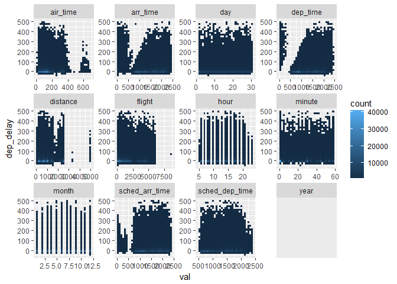
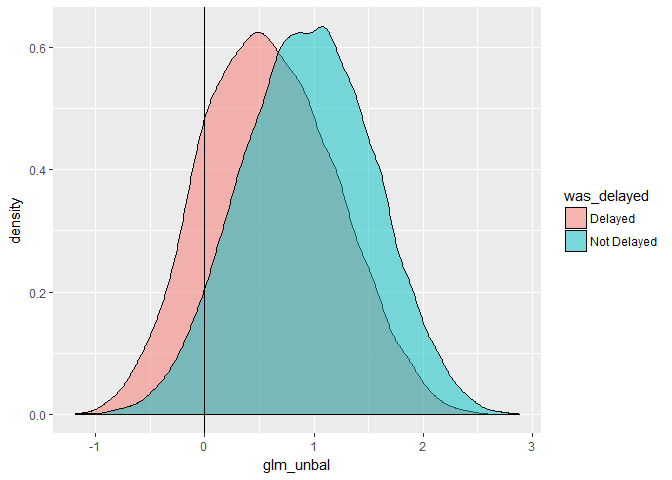

Applied Data Science course material
================

Packages
--------

Packages we'll look at today:

-   odbc / readxl / readr / dbplyr for data access
-   tidyverse for data manipulation
-   DataExplorer for providing an overview of our data
-   modelr / rsamples for sampling strategy
-   recipes for performing feature engineering
-   glmnet / h2o / FFTrees for building models
-   yardstick / broom for evaluation
-   rmarkdown for documentation

Working with databases
----------------------

We need a database connection before we can do anything with our database. Add it by the below code or go o Connections &gt; New Connection. Inside the "New Connection" we can get the connection code.

``` r
library(DBI)
library(odbc)

Driver = "SQL Server"
Server = "fbmcsads.database.windows.net"
Database = "WideWorldImporters-Standard"
Uid = "adatumadmin"
Pwd = "Pa55w.rdPa55w.rd"


con <- dbConnect(odbc(),
                 driver=Driver,
                 server=Server,
                 database=Database,
                 pwd=Pwd,
                 uid=Uid
                 )
```

Now that we have a DB connection, we can write SQL in a code chunk. We use the above connection name "con".

``` sql
select top 5 * from flights
```

|  year|  month|  day|  dep\_time|  sched\_dep\_time|  dep\_delay|  arr\_time|  sched\_arr\_time|  arr\_delay| carrier |  flight| tailnum | origin | dest |  air\_time|  distance|  hour|  minute| time\_hour          |
|-----:|------:|----:|----------:|-----------------:|-----------:|----------:|-----------------:|-----------:|:--------|-------:|:--------|:-------|:-----|----------:|---------:|-----:|-------:|:--------------------|
|  2013|      1|    1|        517|               515|           2|        830|               819|          11| UA      |    1545| N14228  | EWR    | IAH  |        227|      1400|     5|      15| 2013-01-01 05:00:00 |
|  2013|      1|    1|        533|               529|           4|        850|               830|          20| UA      |    1714| N24211  | LGA    | IAH  |        227|      1416|     5|      29| 2013-01-01 05:00:00 |
|  2013|      1|    1|        542|               540|           2|        923|               850|          33| AA      |    1141| N619AA  | JFK    | MIA  |        160|      1089|     5|      40| 2013-01-01 05:00:00 |
|  2013|      1|    1|        544|               545|          -1|       1004|              1022|         -18| B6      |     725| N804JB  | JFK    | BQN  |        183|      1576|     5|      45| 2013-01-01 05:00:00 |
|  2013|      1|    1|        554|               600|          -6|        812|               837|         -25| DL      |     461| N668DN  | LGA    | ATL  |        116|       762|     6|       0| 2013-01-01 06:00:00 |

We can use bdplyr to construct dplyr commands that work on the DB.

``` r
library(tidyverse)
```

    ## -- Attaching packages -------------------------------------------------------------------------------- tidyverse 1.2.1 --

    ## v ggplot2 2.2.1     v purrr   0.2.4
    ## v tibble  1.4.2     v dplyr   0.7.4
    ## v tidyr   0.8.0     v stringr 1.3.0
    ## v readr   1.1.1     v forcats 0.2.0

    ## -- Conflicts ----------------------------------------------------------------------------------- tidyverse_conflicts() --
    ## x dplyr::filter() masks stats::filter()
    ## x dplyr::lag()    masks stats::lag()

``` r
library(dbplyr) # tip: read the introduction to dbplyr package to know how to connect to db
```

    ## 
    ## Attaching package: 'dbplyr'

    ## The following objects are masked from 'package:dplyr':
    ## 
    ##     ident, sql

``` r
flights_tbl <- tbl(con, "flights")

flights_tbl %>% 
  filter(month<=6) %>% 
  group_by(origin) %>% 
  summarise(n = n(), 
            mean_dist= mean(distance)) %>% 
  show_query()
```

    ## Warning: Missing values are always removed in SQL.
    ## Use `AVG(x, na.rm = TRUE)` to silence this warning

    ## <SQL>
    ## SELECT "origin", COUNT(*) AS "n", AVG("distance") AS "mean_dist"
    ## FROM "flights"
    ## WHERE ("month" <= 6.0)
    ## GROUP BY "origin"

We can also work with tables that aren'nt in the default schema.

``` r
purchaseorders_tbl <- tbl(con, in_schema("purchasing", "purchaseorders")) # tip: see the documentation for in_schema in the dbplyr package to know hos to refer to a table in a schema. 

purchaseorders_tbl %>% 
  top_n(5)
```

    ## Selecting by LastEditedWhen

    ## # Source:   lazy query [?? x 12]
    ## # Database: Microsoft SQL Server
    ## #   12.00.0300[dbo@fbmcsads/WideWorldImporters-Standard]
    ##   PurchaseOrderID SupplierID OrderDate  DeliveryMethodID ContactPersonID
    ##             <int>      <int> <chr>                 <int>           <int>
    ## 1            2073          4 2016-05-31                7               2
    ## 2            2074          7 2016-05-31                2               2
    ## 3            2071          4 2016-05-30                7               2
    ## 4            2072          7 2016-05-30                2               2
    ## 5            2068          4 2016-05-27                7               2
    ## 6            2069          7 2016-05-27                2               2
    ## 7            2070          4 2016-05-28                7               2
    ## # ... with 7 more variables: ExpectedDeliveryDate <chr>,
    ## #   SupplierReference <chr>, IsOrderFinalized <lgl>, Comments <chr>,
    ## #   InternalComments <chr>, LastEditedBy <int>, LastEditedWhen <chr>

To write SQL updates, create views etc - it is better to use the DBI packages instead of dbplyr.

We can use the 'Id()' function from DBI to work with schema more generically within a database. This means we aren't restricted to just SELECT statements.

``` r
# Create a schema to work in - errors if already exists
dbGetQuery(con, "CREATE SCHEMA DBIexampleEVA") # creates my own schema in db
```

    ## Error: <SQL> 'CREATE SCHEMA DBIexampleEVA'
    ##   nanodbc/nanodbc.cpp:1587: 42S01: [Microsoft][ODBC SQL Server Driver][SQL Server]There is already an object named 'DBIexampleEVA' in the database.

``` r
# Write some data / drop & recreate the table if it exists already
dbWriteTable(con, "iris", iris, overwrite=TRUE) # overwrites the table
# Read from newly written table 
head(dbReadTable(con,"iris"))
```

    ##   Sepal.Length Sepal.Width Petal.Length Petal.Width Species
    ## 1          5.1         3.5          1.4         0.2  setosa
    ## 2          4.9         3.0          1.4         0.2  setosa
    ## 3          4.7         3.2          1.3         0.2  setosa
    ## 4          4.6         3.1          1.5         0.2  setosa
    ## 5          5.0         3.6          1.4         0.2  setosa
    ## 6          5.4         3.9          1.7         0.4  setosa

``` r
# Read from a table in a schema
head(dbReadTable(con,Id(schema="20774A", table="CustomerTransactions")))
```

    ## Note: method with signature 'DBIConnection#SQL' chosen for function 'dbQuoteIdentifier',
    ##  target signature 'Microsoft SQL Server#SQL'.
    ##  "OdbcConnection#character" would also be valid

    ##                  CustomerName TransactionAmount OutstandingBalance
    ## 1             Aakriti Byrraju           2645.00                  0
    ## 2                  Bala Dixit            465.75                  0
    ## 3 Tailspin Toys (Head Office)            103.50                  0
    ## 4 Tailspin Toys (Head Office)            511.98                  0
    ## 5                Sara Huiting            809.60                  0
    ## 6                Alinne Matos            494.50                  0
    ##   TaxAmount PKIDDate TransactionDate
    ## 1    345.00 20130101      2013-01-01
    ## 2     60.75 20130101      2013-01-01
    ## 3     13.50 20130101      2013-01-01
    ## 4     66.78 20130101      2013-01-01
    ## 5    105.60 20130101      2013-01-01
    ## 6     64.50 20130101      2013-01-01

``` r
# If a write method is supported by the driver, this will work
dbWriteTable(con, Id( schema="DBIexampleEVA", table="iris", overwrite=TRUE))
```

    ## Error in (function (classes, fdef, mtable) : unable to find an inherited method for function 'dbWriteTable' for signature '"Microsoft SQL Server", "SQL", "missing"'

Some of our code could fail in that section so we used `error=TRUE` to be able to carry on even if some of the code errored. Great for optional cose or things with bad connection.

Explorative Data Analysis (EDA) using the DataExplorer package
--------------------------------------------------------------

High-level report to help us understand the data. Group discrete features into a "other" category. Make sure only to include the scheduled hour and not the

``` r
flights_tbl %>% 
  as_data_frame() %>% 
  DataExplorer::GenerateReport()
```

### Questions

Questions arising from the basic report:

1.  Why is there a day with double the number of flights?
2.  The date 31:st doesn't have as many flights as other days, do we need to adjust for this?
3.  Do we need to do anything about missings or can we just remove the rows?
4.  Why is there negative correlation between `flights` (flight number) and `distance`?

Things to implement later in the workflow due to the EDA: 1. We need to address the high correlation between time columns 2. We need to group low frequency airline carriers 3. Bivariate analysis

### Answering our questions

> Why is there a day with double the number of flights?

Are there duplicate rows?

``` r
flights_tbl %>% 
  filter(day==15) %>% 
  distinct() %>% 
  summarise(n()) %>% 
  as_data_frame()->
  distinct_count

flights_tbl %>% 
  filter(day==15) %>% 
  summarise(n())%>% 
  as_data_frame() ->
  row_count

identical(row_count,distinct_count)
```

If the identical() is TRUE, they are exactly equal, meaning that we not have any duplicate rows. But are the number of rows unusual?

``` r
library(ggplot2)
flights_tbl %>% 
  group_by(day) %>% 
  summarise(n=n(), n_distinct(flight)) %>% 
  as_data_frame() %>% 
  ggplot(aes(x=day, y=n)) + geom_col()
```

 Looks like the jump in the histogram is an artifact with the data visualization binning data.

### Bivariate analysis

Next answer

> Bivariate analysis

``` r
flights_tbl %>% 
  select_if(is.numeric) %>% 
  as_data_frame() %>% 
  gather(col, val, -dep_delay) %>% # takes our wide data and turn it into long data, aka pivot all columns without the dep_delay.
  filter(col!="arr_delay",
         dep_delay<500) %>% 
  ggplot(aes(x=val, y=dep_delay)) +
  #  geom_point() +  # this will take long time since it is plotting row by row
  geom_bin2d() + 
   facet_wrap(~col, scales = "free") # take different parts of our data to produce them as charts
```

    ## Applying predicate on the first 100 rows

    ## Warning: Removed 1631 rows containing non-finite values (stat_bin2d).

    ## Warning: Computation failed in `stat_bin2d()`:
    ## 'from' must be a finite number

 \#\# Sampling: Inbalanced data

### Theory/info

In our data model, 97% are delayed. This means that the model always will predict "delayed". We have some options to deal with this.

-   Undersampling (downsampling). Consequence: reducing data since we reduce the data to fit out imbalanced data.
-   Upsampling. Consequence: risks of overfitting. Doesn't reduce training data
-   Synthesising data makes extra records that are like the minority class (Doesn't reduce training set, Avoids some of the overfit risk of upsampling, Can weaken predictions if minority data is very similair to majority)

We need to think about whether we need to k-fold cross-validation explicitly.

-   Run the same model and assess robustness of coefficients
-   We have an algorithm that needs explicit cross validation because it doesn't do it internally
-   When we're going to run lots of models with hyper-parameter tuning do the results are more consistent

We use bootstrapping when we want t fit a single model and ensure the results are robust. This will often do many more iterations than k-fold cross validation, making it better in cases where there's relatively small amounts of data.

Packages we can use for sampling incude:

-   modelr which facilitates bootstrap and k-fold cross validation strategies
-   rsample allows us to bootstrap and perform a wide variety of cross validation tasks
-   recipes allows us to upsample and downsample
-   synthpop allows us to build synthesised samples

``` r
## The devtools are not updated in our cran verison, so we install them separate 
install.packages("devtools")
```

    ## Installing package into 'C:/Users/Admin/Documents/R/win-library/3.4'
    ## (as 'lib' is unspecified)

    ## package 'devtools' successfully unpacked and MD5 sums checked
    ## 
    ## The downloaded binary packages are in
    ##  C:\Users\Admin\AppData\Local\Temp\Rtmp88T2oA\downloaded_packages

``` r
devtools::install_github("topepo/recipes")
```

    ## Skipping install of 'recipes' from a github remote, the SHA1 (4fb3fe10) has not changed since last install.
    ##   Use `force = TRUE` to force installation

### Practical

``` r
flights_tbl %>% 
  as_data_frame() ->
  flights #insert our flights data to in-memory to be able to use the chosen packages

flights %>% 
  mutate(was_delayed=ifelse(arr_delay>5,"Delayed", "Not Delayed"),
         week= ifelse(day %/% 7 > 3, 3, day %/% 7 )) -> # here we adding columns that are not related to predicting variables, like changing time to hours 
  flights

flights %>% 
  modelr::resample_partition(c(train=0.7, test=0.3)) ->
  splits

splits %>% 
  pluck("train") %>% 
  as_data_frame()->
  train_raw

splits %>% 
  pluck("test") %>% 
  as_data_frame()->
  test_raw
```

During the investigation we will look at the impact of upsampling. We'll see it in action in a bit. First prepping our basic features!

#### Basic Feature Engineering

``` r
library(recipes)
```

    ## Loading required package: broom

    ## 
    ## Attaching package: 'recipes'

    ## The following object is masked from 'package:stringr':
    ## 
    ##     fixed

    ## The following object is masked from 'package:stats':
    ## 
    ##     step

``` r
basic_fe <- recipe(train_raw, was_delayed~. ) # we use was_delayed as predictor and everything else as variables

basic_fe %>% 
  step_rm(ends_with("time"), ends_with("delay"), tailnum, flight, minute, time_hour, day) %>%  # remove some variables
 # step_corr(all_predictors()) %>% # remove highly correlates with other variables
  step_zv(all_predictors()) %>% 
  step_nzv(all_predictors()) %>% 
  step_naomit(all_predictors()) %>% # remove rows that have missing values, since only 3 perc are missing
  step_naomit(all_outcomes()) %>% 
  step_other(all_nominal(), threshold = 0.03)-> # will pool infrequently occuring values into an "other category" 
  colscleaned_fe

colscleaned_fe
```

    ## Data Recipe
    ## 
    ## Inputs:
    ## 
    ##       role #variables
    ##    outcome          1
    ##  predictor         20
    ## 
    ## Operations:
    ## 
    ## Delete terms ends_with("time"), ends_with("delay"), ...
    ## Zero variance filter on all_predictors()
    ## Sparse, unbalanced variable filter on all_predictors()
    ## Removing rows with NA values in all_predictors()
    ## Removing rows with NA values in all_outcomes()
    ## Collapsing factor levels for all_nominal()

``` r
colscleaned_fe <- prep(colscleaned_fe, verbose = TRUE) # if error, type verbose=TRUE to print more error info
```

    ## oper 1 step rm [training] 
    ## oper 2 step zv [training] 
    ## oper 3 step nzv [training] 
    ## oper 4 step naomit [training] 
    ## oper 5 step naomit [training] 
    ## oper 6 step other [training]

``` r
colscleaned_fe
```

    ## Data Recipe
    ## 
    ## Inputs:
    ## 
    ##       role #variables
    ##    outcome          1
    ##  predictor         20
    ## 
    ## Training data contained 235743 data points and 6683 incomplete rows. 
    ## 
    ## Operations:
    ## 
    ## Variables removed dep_time, sched_dep_time, arr_time, ... [trained]
    ## Zero variance filter removed year [trained]
    ## Sparse, unbalanced variable filter removed no terms [trained]
    ## Removing rows with NA values in all_predictors()
    ## Removing rows with NA values in all_outcomes()
    ## Collapsing factor levels for carrier, origin, dest, was_delayed [trained]

``` r
train_prep1<-bake(colscleaned_fe, train_raw) # use the recipe to clean the train dataset
```

Now we need to process our numeric variables.

``` r
colscleaned_fe %>% 
  step_log(distance) %>% 
  step_num2factor(month, week, hour) %>% 
  step_rm(tailnum)->
  numscleaned_fe

numscleaned_fe
```

    ## Data Recipe
    ## 
    ## Inputs:
    ## 
    ##       role #variables
    ##    outcome          1
    ##  predictor         20
    ## 
    ## Training data contained 235743 data points and 6683 incomplete rows. 
    ## 
    ## Operations:
    ## 
    ## Variables removed dep_time, sched_dep_time, arr_time, ... [trained]
    ## Zero variance filter removed year [trained]
    ## Sparse, unbalanced variable filter removed no terms [trained]
    ## Removing rows with NA values in all_predictors()
    ## Removing rows with NA values in all_outcomes()
    ## Collapsing factor levels for carrier, origin, dest, was_delayed [trained]
    ## Log transformation on distance
    ## Factor variables from month, week, hour
    ## Delete terms tailnum

``` r
numscleaned_fe <- prep(numscleaned_fe, verbose = TRUE)
```

    ## oper 1 step rm [pre-trained]
    ## oper 2 step zv [pre-trained]
    ## oper 3 step nzv [pre-trained]
    ## oper 4 step naomit [pre-trained]
    ## oper 5 step naomit [pre-trained]
    ## oper 6 step other [pre-trained]
    ## oper 7 step log [training] 
    ## oper 8 step num2factor [training] 
    ## oper 9 step rm [training]

``` r
numscleaned_fe
```

    ## Data Recipe
    ## 
    ## Inputs:
    ## 
    ##       role #variables
    ##    outcome          1
    ##  predictor         20
    ## 
    ## Training data contained 235743 data points and 6683 incomplete rows. 
    ## 
    ## Operations:
    ## 
    ## Variables removed dep_time, sched_dep_time, arr_time, ... [trained]
    ## Zero variance filter removed year [trained]
    ## Sparse, unbalanced variable filter removed no terms [trained]
    ## Removing rows with NA values in all_predictors()
    ## Removing rows with NA values in all_outcomes()
    ## Collapsing factor levels for carrier, origin, dest, was_delayed [trained]
    ## Log transformation on distance [trained]
    ## Factor variables from month, week, hour [trained]
    ## Variables removed tailnum [trained]

``` r
train_prep1<-bake(numscleaned_fe, train_raw)
```

#### Time for upsampling!

``` r
numscleaned_fe %>% 
  step_upsample(all_outcomes(), ratio = 1) %>% 
  prep(retain=TRUE) %>% 
  juice() %>% 
  bake(numscleaned_fe,.)-> # upsample to 50/50 by repeating the rows with delays 
  train_prep2
```

Building models
---------------

Decide which types of models you want to consider -- perhaps by looking at [cheat sheet](https://docs.microsoft.com/en-us/azure/machine-learning/studio/algorithm-cheat-sheet). Then determine if we need special processing to the data beyond what you've done so far.

### A basic logistic regression

We can use generalized linear regression model functionality to construct a logistic regression.

``` r
glm_unbal<- glm(was_delayed~ . , "binomial", data = train_prep1) # the dataset without upsampling 
glm_bal<- glm(was_delayed~ . , "binomial", data = train_prep2) # the dataset with upsampling
```

Then we can see how these models are constructed and how they perform.

Fit measures on our *training* data

``` r
library(broom)
glance(glm_unbal)
```

    ##   null.deviance df.null    logLik      AIC    BIC deviance df.residual
    ## 1        106326   85022 -49938.39 99980.78 100467 99876.78       84971

Get the coefficients.

``` r
tidy(glm_unbal)
```

    ##           term      estimate  std.error    statistic      p.value
    ## 1  (Intercept)  3.5566271232 4.19707497   0.84740615 3.967688e-01
    ## 2      month10  0.3435297840 0.03920370   8.76268858 1.906478e-18
    ## 3      month11  0.2282014491 0.03911010   5.83484675 5.384003e-09
    ## 4      month12 -0.6395766935 0.03673739 -17.40942348 6.998514e-68
    ## 5       month2 -0.1536865630 0.03927577  -3.91301236 9.115187e-05
    ## 6       month3 -0.0629469028 0.03792342  -1.65984245 9.694615e-02
    ## 7       month4 -0.3167369108 0.03714800  -8.52635123 1.510362e-17
    ## 8       month5  0.1056591117 0.03840459   2.75121070 5.937544e-03
    ## 9       month6 -0.4308229930 0.03703549 -11.63270803 2.810380e-31
    ## 10      month7 -0.4957584550 0.03662460 -13.53621550 9.558814e-42
    ## 11      month8 -0.1522722343 0.03713947  -4.10001043 4.131315e-05
    ## 12      month9  0.6151319216 0.04144794  14.84107488 7.947227e-50
    ## 13   carrierAA  0.3167037959 0.06328176   5.00466142 5.596030e-07
    ## 14   carrierB6 -0.1181425009 0.06280223  -1.88118329 5.994699e-02
    ## 15   carrierDL  0.3805894324 0.06328550   6.01384919 1.811691e-09
    ## 16   carrierEV -0.3014408598 0.07573823  -3.98003584 6.890488e-05
    ## 17   carrierMQ -0.3529174838 0.06940906  -5.08460240 3.683970e-07
    ## 18   carrierUA  0.0794939457 0.06436068   1.23513224 2.167813e-01
    ## 19   carrierUS  0.2944832958 0.07093836   4.15125622 3.306553e-05
    ## 20   carrierWN -0.4039951957 0.32922405  -1.22711324 2.197800e-01
    ## 21   originJFK  0.0004915378 0.02444434   0.02010845 9.839569e-01
    ## 22   originLGA -0.0172488352 0.02356256  -0.73204434 4.641415e-01
    ## 23     destBOS  0.1129650708 0.87010503   0.12982924 8.967015e-01
    ## 24     destCLT -0.0040604014 0.20791281  -0.01952935 9.844188e-01
    ## 25     destFLL  0.2328883762 0.21977012   1.05969083 2.892853e-01
    ## 26     destLAX  0.8197313936 0.74903132   1.09438867 2.737845e-01
    ## 27     destMCO  0.4141839160 0.14160267   2.92497249 3.444867e-03
    ## 28     destMIA  0.4462391979 0.23264973   1.91807310 5.510174e-02
    ## 29     destORD  0.2888152498 0.04508883   6.40547247 1.499044e-10
    ## 30     destSFO  0.7461236465 0.77602219   0.96147205 3.363149e-01
    ## 31    distance -0.3996002082 0.63346638  -0.63081518 5.281614e-01
    ## 32      hour11  0.0990493852 0.05147081   1.92437961 5.430702e-02
    ## 33      hour12 -0.1721858927 0.04650906  -3.70220110 2.137371e-04
    ## 34      hour13 -0.2339055541 0.04648729  -5.03160270 4.863964e-07
    ## 35      hour14 -0.3485038347 0.04646316  -7.50064836 6.350294e-14
    ## 36      hour15 -0.5700912213 0.04394454 -12.97297086 1.741474e-38
    ## 37      hour16 -0.5670213150 0.04590632 -12.35170474 4.769003e-35
    ## 38      hour17 -0.6869408927 0.04382108 -15.67603781 2.205923e-55
    ## 39      hour18 -0.7796209606 0.04537105 -17.18322410 3.546415e-66
    ## 40      hour19 -0.6958925837 0.04600258 -15.12725229 1.070736e-51
    ## 41      hour20 -0.6443874665 0.04836252 -13.32410858 1.676229e-40
    ## 42      hour21 -0.7185843683 0.05185591 -13.85732858 1.148704e-43
    ## 43      hour22 -0.8703558454 0.13252459  -6.56750476 5.116538e-11
    ## 44      hour23 -1.1694674411 0.26426013  -4.42544033 9.624576e-06
    ## 45       hour5  0.4012396477 0.11554985   3.47243757 5.157549e-04
    ## 46       hour6  0.4016026298 0.04483574   8.95719777 3.330340e-19
    ## 47       hour7  0.3236490572 0.04721053   6.85544202 7.109235e-12
    ## 48       hour8  0.1264098589 0.04598696   2.74881943 5.981033e-03
    ## 49       hour9  0.1294313578 0.04641432   2.78860839 5.293503e-03
    ## 50       week1 -0.3854599512 0.02364706 -16.30054510 9.781587e-60
    ## 51       week2 -0.1102809130 0.02393282  -4.60793687 4.066841e-06
    ## 52       week3 -0.1685928280 0.02209056  -7.63189478 2.313282e-14

Get the fitted data

``` r
head(augment(glm_unbal))
```

    ##   .rownames was_delayed month carrier origin dest distance hour week
    ## 1         4 Not Delayed     1      DL    LGA  ATL 6.635947    6    0
    ## 2         5     Delayed     1      B6    EWR  FLL 6.970730    6    0
    ## 3         7 Not Delayed     1      B6    JFK  MCO 6.850126    6    0
    ## 4         8     Delayed     1      AA    LGA  ORD 6.597146    6    0
    ## 5        10     Delayed     1      UA    JFK  LAX 7.813996    6    0
    ## 6        11 Not Delayed     1      UA    EWR  SFO 7.849714    6    0
    ##    .fitted    .se.fit     .resid         .hat   .sigma      .cooksd
    ## 1 1.669845 0.04886606  0.5873734 0.0003184018 1.084173 1.153571e-06
    ## 2 1.287470 0.05061276 -1.7499574 0.0004342094 1.084159 3.028409e-05
    ## 3 1.517451 0.04919340  0.6296863 0.0003569385 1.084173 1.506189e-06
    ## 4 1.910279 0.05057965 -2.0240230 0.0002873523 1.084153 3.734949e-05
    ## 5 1.735472 0.05212664 -1.9482611 0.0003462302 1.084155 3.778926e-05
    ## 6 1.647100 0.05080123  0.5935355 0.0003494836 1.084173 1.295390e-06
    ##   .std.resid
    ## 1  0.5874670
    ## 2 -1.7503375
    ## 3  0.6297987
    ## 4 -2.0243138
    ## 5 -1.9485984
    ## 6  0.5936393

Plot predicted vs actuals

``` r
glm_unbal %>% 
  augment() %>% 
  ggplot(aes(x=.fitted, group=was_delayed, fill=was_delayed)) +
  geom_density(alpha=.5) +
  geom_vline(aes(xintercept=0)) 
```

 This would be good model if we have no overlap of the blue and red. Anything negative, have less prob of 50% of being delayed. Anything positive, prob higher than 50% of not being delayed. If logit higher than 0, our model will predict not delayed IF logit lower than 0, our model will predict delayed

Business decision where to put the cut-off line.

### Prep and predict on test data

``` r
library(modelr)
```

    ## 
    ## Attaching package: 'modelr'

    ## The following object is masked from 'package:broom':
    ## 
    ##     bootstrap

``` r
test_raw %>% 
  bake(numscleaned_fe, .) %>% 
  modelr::add_predictions(glm_unbal,var="glm_unbal") ->
  #modelr::add_predictions(glm_unbal,var="glm_unbal_class", type="class") ->
  test_scored

test_scored %>% 
  ggplot(aes(x=glm_unbal, group=was_delayed, fill=was_delayed)) +
  geom_density(alpha=.5) +
  geom_vline(aes(xintercept=0))
```

    ## Warning: Removed 61824 rows containing non-finite values (stat_density).



``` r
  head(test_scored)
```

    ## # A tibble: 6 x 9
    ##   month carrier origin dest  distance hour  was_delayed week  glm_unbal
    ##   <fct> <fct>   <fct>  <fct>    <dbl> <fct> <fct>       <fct>     <dbl>
    ## 1 1     AA      JFK    MIA       6.99 5     Delayed     0         1.93 
    ## 2 1     UA      EWR    ORD       6.58 5     Delayed     0         1.70 
    ## 3 1     B6      JFK    <NA>      6.91 6     Not Delayed 0        NA    
    ## 4 1     UA      EWR    <NA>      7.71 6     Not Delayed 0        NA    
    ## 5 1     MQ      LGA    ATL       6.64 6     Delayed     0         0.936
    ## 6 1     B6      JFK    <NA>      6.98 6     Not Delayed 0        NA

But how many did we get right etc?

``` r
library(yardstick)
```

    ## 
    ## Attaching package: 'yardstick'

    ## The following objects are masked from 'package:modelr':
    ## 
    ##     mae, rmse

    ## The following object is masked from 'package:readr':
    ## 
    ##     spec

``` r
test_scored %>% 
  mutate(glm_unbal_class=as.factor(
    ifelse(glm_unbal<0, "Delayed", "Not Delayed"))) %>% 
  conf_mat(was_delayed, glm_unbal_class)
```

    ##              Truth
    ## Prediction    Delayed Not Delayed
    ##   Delayed        1956        1426
    ##   Not Delayed    9542       23538

``` r
test_scored %>% 
  mutate(glm_unbal_class=as.factor(
    ifelse(glm_unbal<0, "Delayed", "Not Delayed"))) %>% 
  accuracy(was_delayed, glm_unbal_class)
```

    ## [1] 0.6991937
